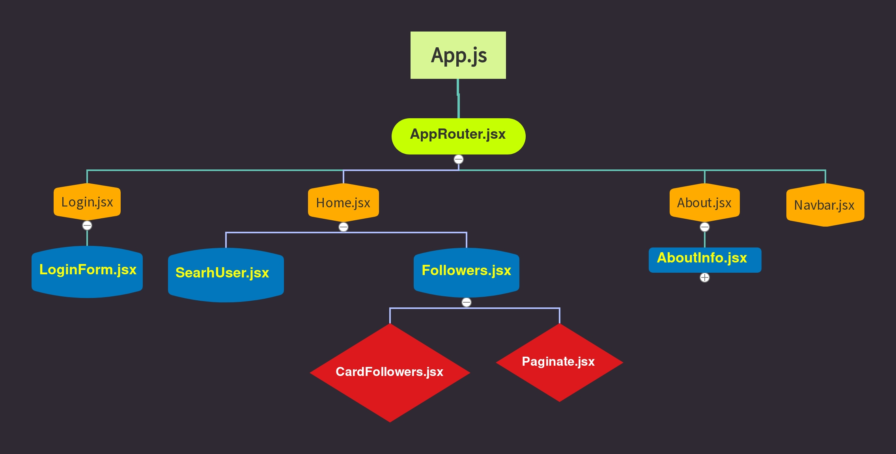

# Axios-Router Project

###Project Tree


### Kullanılan Paketler
```
axios,
react-router-dom,
react-bootsrap //index e link veriyoruz
styled-components
Yükleme Komutları
npm i axios or yarn add axios//axios ile veri çekeilmek için
npm i react-router-dom or yarn add react-router-dom//router yapısını kullanabilmemiz için
npm i react-bootstrap or yarn add react-bootstrap// style de react-boostrapi kullanabilmek
için
npm i styled-components or yarn add styled-components
```
### Projede Kullanılacak olan Api
[Github Api](https://docs.github.com/en/rest/users)
Buradan biz followers kısmını alacağız .
[GithubAPiFollowers](https://api.github.com/users/anthonyharold67/followers?per_page=100)

Api nin verdği farklı veriler de var isteyen inceleyip proje oluşturabilir ona göre.

### React Router
Routing Nedir ? 
```
Yönlendirme, kullanıcıya farklı sayfalar gösterme kapasitesidir. 
Bu, kullanıcının bir URL girerek veya bir öğeye tıklayarak uygulamanın farklı 
bölümleri arasında hareket edebileceği anlamına gelir.
```

Neden react router kullanılıyor ?

React hepimizn bildiği gibi single page bir yapı. sayfalar arası gezinebilmek için router yapısını kullanırız.

Single Page Nedir?
```
Single page application yani kısa adıyla SPA, tek HTML sayfası yükleyen bir uygulamadır 
ve uygulamanın çalışması için gerekli tüm dosyaları (JavaScript, CSS vb) içerir. 
Sayfa veya sonraki sayfalarla olan herhangi bir etkileşim için servera 
gidip gelmesi gerektirmez; bu da sayfanın yeniden yüklenmediği anlamına gelir.
Reactte SPA oluşturabilmenize rağmen, bu bir zorunluluk değildir. 
React, hali hazırda çalışan bir sitenin küçük bölümlerini geliştirmek için 
de kullanılabilir. React’te yazılmış kod, diğer diller ile de kullanılabilir. 
Facebook’un sitesi buna en iyi örnektir
```

Yani normal html projelerinde bizim örneğin home.html,about.html,profile.html yapılarımız var.Biz napıyoruz bunları biribirne `<a>` tagi ile bağlıyoruz. Aslında 3sayfada tek projeye ait ama html yapısından ötürü biz home.html den about.html e gitmek istediğimizde farklı bir sayfaya gidiyoruz.
React ta ise tek bir sayfa içinde sayfa olarak oluşturduğumuz componentler arasında geziniyoruz

### React Router a özgü kavramlar
**BrowserRouter**: Tanımlanan Yerlere Sayfaların Render Edileceğini Bildiren component. En dış sarmalayıcıdır.

**Routes:** Konum her değiştiğinde, Routes en iyi eşleşmeyi bulmak için childları olan tüm alt Route öğelerine bakar ve kullanıcı arabiriminin bu dalını oluşturur.

**Route:**  Url pathinde gelene göre hangi sayfanın(yani hangi componentin) render edileceğini belirten component. Ve eğer birden fazla Route varsa bunları Routes sarmalında tanımlamamız gerekir. Yoksa şu şekilde hata alırız:
```
Bir <Route>, yalnızca <Routes> öğesinin alt öğesi olarak kullanılır, hiçbir zaman doğrudan işlenmez. Lütfen <Route>'unuzu bir <Routes> ile sarın.
```
**NavLink:**  Geçerli URL ile eşleştiğinde, render edilmiş elemente css ekleyecek bir `<Link>` sürümüdür. Css te a tagi olarak verebiliyoruz.*`Navlink` kullanmak için `react-router-dom`dan import etmemiz gerekiyor*

Kısaca Link,NavLink ve a href farkında bahsedelim
```
Single page application uygulamarında temel mantık aynı sayfada sayfa yenilenmeden istenilen komponentin sayfaya çağırılmasıdır.

Burada bazı react projelerinde dikkat çeken bir nokta projenin navigasyonunda gezerken sayfanın her linke 
tıklandığında sayfanın kendini yenilemesi (refresh) dir. 
Bunun nedeni ise linke tıklandığında çağırılan komponentin

<a href="/componentAdi"></a>
şeklinde çağırılmış olmasıdır.

Eğer a etiketi yerine react-dom elementi olan Link etiketi kullanılırsa

<Link to="/componentAdi"></Link>
sayfa yenileme problemi ortadan kalkacaktır.

Bu kullanım sadece React özelinde değil diğer SPA uygulamarı içinde geçerlidir.
```